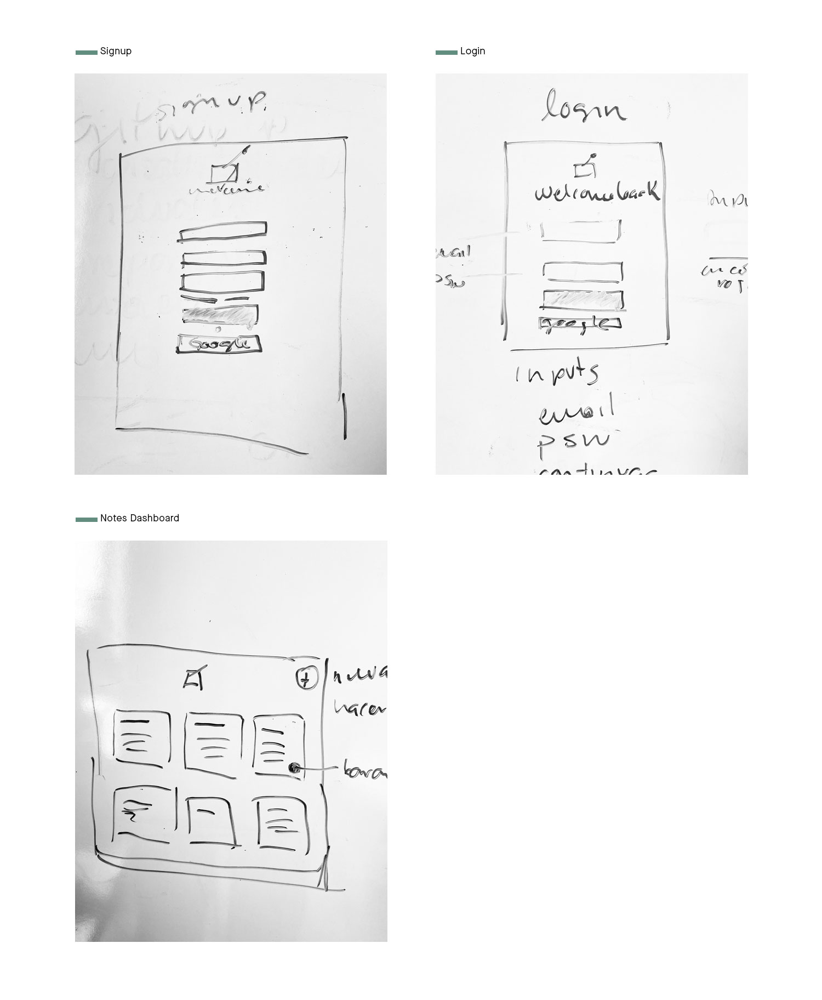
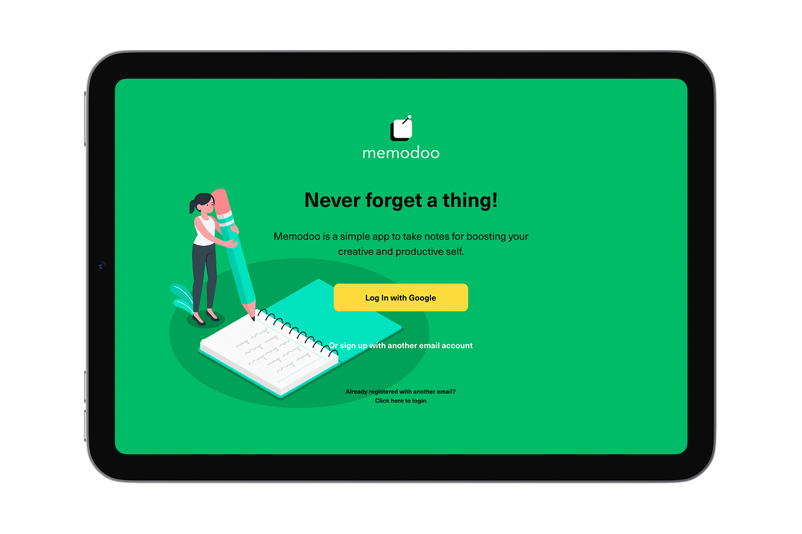
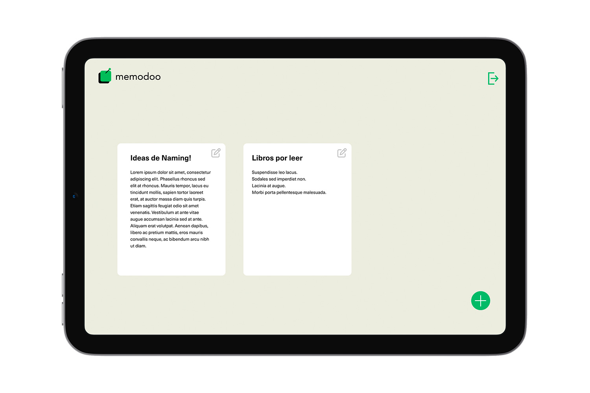
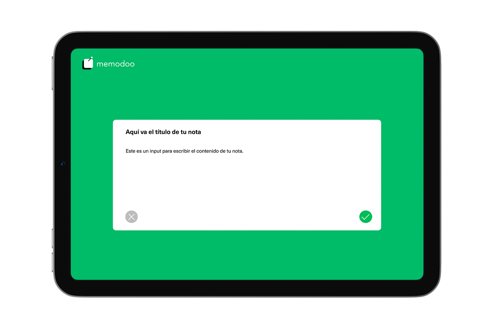

# Memodoo is a note taking SPA

***

## About this project

**Memodoo** is a note taking app for organizing your toughts, improve your creativity and productivity.

This SPA (Single Page Application) was build using React and Firestore it allows you to authenticate with Google and another email account. Memodoo it's a basic CRUD application where you can view your notes dashboard, create a new one, edit and delete them.

## Low-fi Prototype

***
## High Fidelity Prototype

